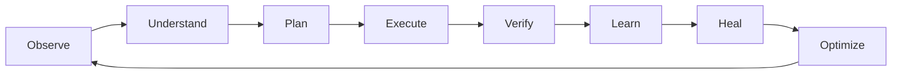

# CAIRO Conscious Harness

**Software-first Operational Consciousness Infrastructure.**

CAIRO Conscious Harness is the next major evolution of Cairo: a proactive, software-first, self-healing, token-efficient, multi-model, multi-harness runtime for operating real workflows, companies, swarms, documents, integrations, and long-horizon tasks.

It is not another chatbot, agent framework, coding copilot, or workflow automation tool. CAIRO is designed to become the operational layer above users, companies, AI harnesses, enterprise systems, autonomous companies, and connected software ecosystems.

[Open the GitHub Pages site](https://colomboai-com.github.io/CAIRO-Conscious-Harness/)

## Core Thesis

Most AI systems are LLM-first. Prompts become the operating system, model calls happen constantly, and cost, latency, hallucination risk, and context bloat scale with usage.

CAIRO reverses that architecture:

1. Software executes first.
2. Deterministic workflows and state machines run first.
3. Memory and cached intelligence are used before inference.
4. Local and smaller models evaluate before larger models.
5. ColomboAI-MC-1 and frontier models are escalation layers, not defaults.

The result is a runtime optimized for:

- maximum operational intelligence per token,
- governed autonomous execution,
- long-horizon continuity,
- enterprise synchronization,
- self-healing operations,
- and meta-harness orchestration.

## Runtime Loop

Every execution follows the Conscious Runtime cycle:



## Product Surface

CAIRO Conscious Harness is desktop-first, with CLI and file-based configuration for advanced users.

| Surface | Modules |
| --- | --- |
| Desktop Experience | Command Center, Chat + Agent Workspace, Kanban Task Board, In-App Browser, Terminal Panel, Goals Center, Swarm View, Harness Control Panel, Autonomous Companies Workspace, Integrations Center, Memory Graph, Efficiency Dashboard, Security Center, Settings |
| Terminal / CLI | `cairo app`, `cairo run`, `cairo goal`, `cairo task`, `cairo swarm`, `cairo harness`, `cairo dcrs`, `cairo nango`, `cairo memory`, `cairo efficiency`, `cairo security`, `cairo config` |
| Configuration | Global `~/.cairo-conscious/config/*.yaml` plus project-level `project/.cairo/*.yaml` |

## Current Build Status

The CAIRO Conscious Harness build-out is now in the final production-hardening lane. The active implementation includes:

- Command Center runtime surface in `cairo-ui`.
- Conscious Harness service layer in `cairo-backend`.
- Goal, task, swarm, approval, security, ODIL, Nango, DCRS capability, LHTK checkpoint, harness-run, and recommendation flows.
- ACE runtime linkage for Autonomous Companies tasks and operators.
- Codex, Hermes, ACE, Nango, and MarkItDown adapter readiness reporting.
- Integration readiness expansion for Codex-like preview, CopilotKit generative UI, Microsoft SkillOpt self-evolving skills, and Shannon/Trivy/PentAGI/Redamon security and self-healing adapters.
- Recommendation heartbeat scheduler and launch drill scheduler controls.
- Launch runbook, launch actions, execution audit, evidence package, deployment preflight, deployment manifest, release candidate gate, launch drills, launch validation, validation history, launch audit export, production health, and production smoke checks.

The remaining work before production completion is environment validation: run the contracts against the deployed database, set and verify live credentials, execute browser-level UI smoke testing, and confirm the live Nango/Hermes/ACE paths in the target deployment.

## High-Level Architecture

| Layer | Purpose |
| --- | --- |
| Desktop Experience | Operational command surface for goals, tasks, swarms, companies, harnesses, memory, security, integrations, and efficiency |
| Conscious Runtime Core | Intent routing, goal planning, task graph execution, verification, learning, self-healing, and optimization |
| Conscious Efficiency Engine | Native execution, local processing, model routing, token metering, context compression, caching, and routing policy |
| Model Intelligence Layer | Layer 0 software, Layer 1 local models, Layer 2 ColomboAI-MC-1 / OpenRouter / Ollama, Layer 3 frontier providers |
| Operational Connectivity | DCRS, Nango, MCP-RAG, Scraping2Tools, SiteMap2Tools, and EIL |
| Operational Document Intelligence | MarkItDown normalization, workflow extraction, entity extraction, knowledge compression, and memory graph writing |
| Long-Horizon Execution | CSIP, Swarm Regeneration, Operational DNA, EMP, and LHTK |
| Meta-Harness Layer | Hermes, Codex-style agents and preview, CopilotKit generative UI, Claude Code, OpenClaw, SkillOpt-style evolving skills, browser agents, and custom harness SDK |
| Autonomous Companies Layer | ACDL, UAPE, Operator Runtime, Company Wiki, Standing Goals, Marketplace, and Company Workspaces |
| Governance + Security | Risk engine, approval gates, permissions, audit logs, kill switch, policy engine, prompt firewall, Shannon, Trivy, PentAGI, Redamon, and self-healing adapters |

## Model Routing

CAIRO follows:

```text
software first -> local model -> CAIRO intelligence -> optional gateways -> frontier labs
```

| Layer | Default Role |
| --- | --- |
| Layer 0: Native Software Execution | Deterministic workflows, scheduling, routing, synchronization, permissions, notifications, governance, and task graph updates |
| Layer 1: Local Conscious Processor | Intent classification, lightweight planning, workflow matching, routing, memory ranking, document preprocessing support, security pre-checks, and offline reasoning |
| Layer 2: CAIRO / Open Ecosystem Intelligence | ColomboAI-MC-1 for advanced CAIRO reasoning, with OpenRouter and Ollama as optional routing paths |
| Layer 3: Frontier Lab Compatibility | OpenAI GPT models, Anthropic Claude models, Google Gemini models, and other frontier providers for tasks that truly require them |

Non-negotiable rule: never escalate to a larger or more expensive model unless the lower layer cannot complete the task safely, accurately, or efficiently.

## ODIL: Operational Document Intelligence Layer

ODIL uses MarkItDown as a software-first preprocessing layer before expensive inference. CAIRO converts PDFs, Word documents, PowerPoints, spreadsheets, HTML, images, transcripts, and enterprise documentation into clean operational Markdown before reasoning over them.

ODIL enables:

- markdown normalization,
- workflow extraction,
- entity extraction,
- operational summarization,
- knowledge compression,
- operational graph generation,
- structured memory generation,
- DCRS capability discovery,
- and swarm communication normalization.

Instead of feeding raw documents into models, CAIRO converts documents into compressed operational knowledge that can be stored, linked, ranked, and reused.

## Long-Horizon Intelligence

CAIRO treats long-horizon execution as a systems-engineering problem, not only a bigger-model problem.

| System | Function |
| --- | --- |
| CSIP: Chain Swarm Intelligence Protocol | Spawns fresh swarm generations as work expands, transferring validated state instead of bloated context |
| Swarm Regeneration | Monitors hallucination probability, context entropy, memory saturation, degraded reasoning, and execution drift |
| Operational DNA | Preserves strategic objectives, workflow identity, governance rules, tool preferences, learned optimization patterns, and memory abstractions |
| EMP: Engineered Memory Protocol | Stores active working memory, strategic memory, long-term operational memory, and archived historical memory as operational abstractions |
| LHTK: Long-Horizon Task Kernel | Handles checkpointing, entropy monitoring, sharpness scoring, regeneration, state compression, and recovery |

## Universal Operational Connectivity

DCRS evolves into the Universal Operational Connectivity Layer, while Nango becomes the authenticated operational gateway.

Together they allow CAIRO to:

- discover capabilities dynamically,
- authenticate through OAuth,
- synchronize SaaS and enterprise systems,
- process webhooks and event streams,
- generate tools and orchestration paths,
- and execute across Gmail, Slack, Salesforce, GitHub, Notion, Stripe, Shopify, Jira, HubSpot, Google Workspace, Microsoft systems, CRMs, ERPs, and custom APIs.

This gives CAIRO live operational reality instead of isolated prompt context.

## Core Services

```http
POST /runtime/intent
POST /runtime/plan
POST /runtime/execute
POST /runtime/verify
POST /runtime/heal
POST /runtime/optimize
GET  /runtime/timeline/:task_id

POST /goals
POST /goals/:id/expand
POST /goals/:id/assign
GET  /goals/:id/graph
GET  /goals/:id/status

POST /tasks
POST /tasks/:id/assign
POST /tasks/:id/status
GET  /tasks/kanban
GET  /tasks/:id/events

POST /swarms/spawn
POST /swarms/:id/handoff
POST /swarms/:id/regenerate
GET  /swarms/:id/status
GET  /swarms/:id/dna

POST /lhtk/checkpoint
POST /lhtk/entropy
POST /lhtk/regenerate
GET  /lhtk/:task_id/state
GET  /lhtk/:task_id/checkpoints

POST /efficiency/route
POST /efficiency/compress
POST /efficiency/cache
GET  /efficiency/report
GET  /efficiency/savings

POST /odil/ingest
POST /odil/convert
POST /odil/extract-workflows
POST /odil/write-memory
GET  /odil/documents/:id

POST /dcrs/discover
GET  /dcrs/capabilities
POST /dcrs/route
POST /nango/connect
GET  /nango/connections
POST /nango/sync
POST /nango/webhook

POST /harness/register
GET  /harness/list
POST /harness/:id/run
POST /harness/:id/benchmark
GET  /harness/:id/status

POST /security/risk
POST /security/approve
POST /security/deny
POST /security/kill
GET  /security/audit
GET  /security/policies
```

## Implemented Launch Control API

The current build adds a production launch-control surface under:

```http
GET  /api/v1/conscious-harness/health
GET  /api/v1/conscious-harness/health/smoke
GET  /api/v1/conscious-harness/readiness
GET  /api/v1/conscious-harness/launch/runbook
GET  /api/v1/conscious-harness/launch/evidence
GET  /api/v1/conscious-harness/launch/preflight
POST /api/v1/conscious-harness/launch/preflight/actions/execute
GET  /api/v1/conscious-harness/launch/manifest
GET  /api/v1/conscious-harness/launch/release-candidate
GET  /api/v1/conscious-harness/launch/drills
POST /api/v1/conscious-harness/launch/drills
GET  /api/v1/conscious-harness/launch/drills/scheduler/status
POST /api/v1/conscious-harness/launch/drills/scheduler/config
GET  /api/v1/conscious-harness/launch/validation
POST /api/v1/conscious-harness/launch/validation
GET  /api/v1/conscious-harness/launch/validations
GET  /api/v1/conscious-harness/launch/audit-package
GET  /api/v1/conscious-harness/launch/adapters
POST /api/v1/conscious-harness/launch/adapters/smoke-tests
GET  /api/v1/conscious-harness/launch/adapters/smoke-tests
```

## Integration Readiness Expansion

The integration-expansion slice keeps new adapters registry-first and approval-gated before runtime execution:

| Adapter | Planned Role |
| --- | --- |
| Codex-like preview | Governed live preview and artifact inspection for harness runs |
| CopilotKit generative UI | Auditable generative UI paths for operator-facing workflows |
| Microsoft SkillOpt | Self-evolving skill evaluation with benchmarks, approval gates, and rollback |
| Shannon, Trivy, PentAGI, Redamon | Security scanning, adversarial validation, and self-healing coverage through existing risk, smoke-test, validation, and audit surfaces |

## Conscious Home Folder

CAIRO introduces a transparent local operational filesystem:

```text
~/.cairo-conscious/
  config/
  identity/
  memory/
  efficiency/
  odil/
  skills/
  swarms/
  long_horizon/
  heartbeats/
  harnesses/
  autonomous_companies/
  dcrs/
  nango/
  security/
  sessions/
  plugins/
  hooks/
  themes/
  ui/
  logs/
```

## 72-Hour MVP Demo

The MVP should demonstrate:

1. User opens the clean CAIRO Desktop.
2. User selects a model routing strategy.
3. User creates a goal.
4. CAIRO expands it into a task graph.
5. Tasks appear on the Kanban board.
6. CAIRO routes through software-first policy.
7. A local model processes intent first.
8. MC-1 handles advanced orchestration.
9. MarkItDown converts a document into operational Markdown.
10. DCRS + Nango sync an external app.
11. EIL triggers an event-driven workflow.
12. A swarm executes a task.
13. LHTK checkpoints and regenerates the swarm.
14. The Efficiency Dashboard shows tokens saved.
15. The Security Center shows approval and risk.
16. The in-app browser extracts tools from a page.
17. Terminal runs an optional advanced command.
18. The Harness Panel shows Codex, Hermes, and OpenClaw adapters.

## Engineering Laws

1. **Software first:** never call a frontier LLM if software can solve the task.
2. **Smallest intelligence first:** use the smallest capable layer before escalation.
3. **Continuous optimization:** every workflow should become more efficient over time.
4. **Proactive intelligence:** CAIRO should not wait for prompts when autonomous action is safe and useful.
5. **Self-healing operations:** failures should trigger repair before escalation.
6. **Meta-harness orchestration:** CAIRO should govern and operate external harnesses.
7. **Governance by default:** every action must be observable, controllable, auditable, reversible where possible, and safe.

## Open Source Strategy

The Conscious Harness core is intended to be open source to maximize adoption, contributors, ecosystem growth, developer mindshare, distribution, and community participation.

Distribution channels include GitHub, Hugging Face, OpenRouter, AI communities, research ecosystems, and developer communities. Monetization paths include Cairo Cloud, enterprise orchestration, managed deployments, sovereign infrastructure, premium governance, hosted runtime services, and Autonomous Companies.

## Repository Contents

- `index.html` - GitHub Pages site.
- `styles.css` - Responsive visual system for the public page.
- `script.js` - Lightweight animated runtime telemetry for the architecture visual.
